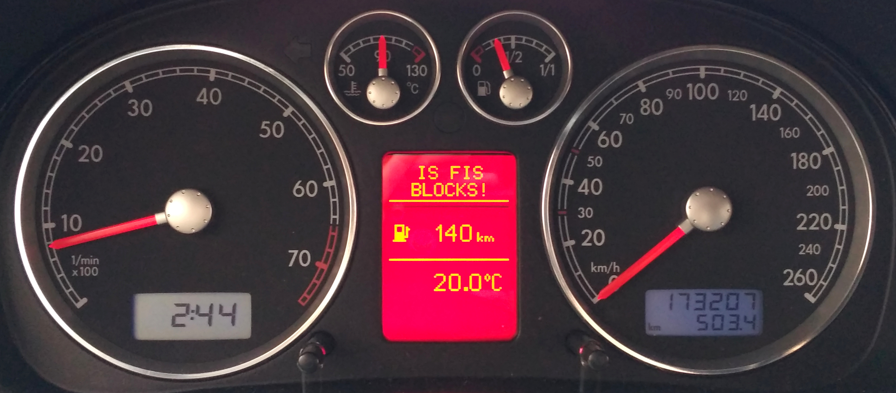
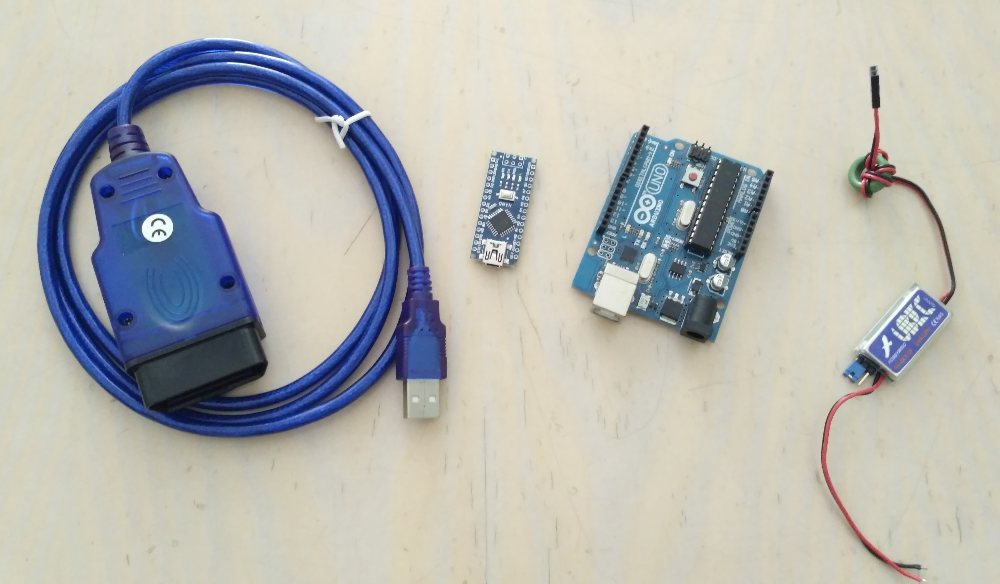
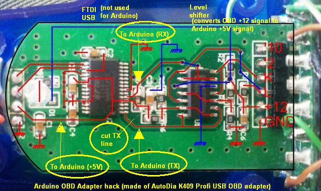

# Welcome to FISBlocks!

[ENG]
[[ESP]](./ReadmeSpanish.md)

.

## Sumary:

The FISBlocks is an Arduino based device that allows us to consult in real time mechanical parameters of the vehicle to diagnose its state and predict faults. It implements part of the private protocol KWP1281 used in all vehicles of the group VAG (Audi, Seat, Volkswagen ...) since 1998 to carry out the diagnosis and obtain the information. In addition, this device also implements part of the private 3LB protocol that allows us to control the content that is displayed by the secondary screen of 2 lines x 8 digits of the instruments that incorporate FIS-DIS technology.

Some of the interesting facts we can get:
* Liters of fuel
* Actual coolant temperature
* AFR
* Turbo pressure
* IAT
* EGT
* Delays / cylinder
* Misfires / cylinder
* MAF
* Voltage
* Engine load
* Securities demanded by the ECU
* ... And in general, any data that can be obtained through the Measurement Blocks of the unit.

.

This project has two main objectives:

* Extract information from the vehicle control units using the KWP1281 protocol and the Measurement Blocks.

* Implement 3LB protocol to display information in the instrument cluster.

## Material needed to build the FISBlocks:

.

* Arduino UNO or similar (ATmega328)
* USB ODB2 Diagnostic Cable 409.1
* Welder, tin cable and solder level "Little ninja" :)
* Optional: 12v to 5v converter

These components can be obtained in many places on the Internet, if you have problems getting them and I could help you get them, contact me through samueliban@gmail.com.

## Preparation of cable 409.1:

The hack designed by Andrew consists of taking advantage of the comparator LM that incorporates the cable OBD to use it with the Arduino through SofwareSerial.

To do this we must dismantle the housings and make 3 modifications on the PCB of the cable:

.

* Cut communication with the FTDI chip that goes to TX and weld the new TX line for Arduino.
* Solder RX to Arduino.
* Solder line 5v to 5v Arduino (to be used as reference voltage, not for power).

The result is this:

.

Once the welds are made we can make the connections with the Arduino.

## Connections between Arduino and peripherals:

The first thing we have to do is look for a power supply for the Arduino at 5v. In this case it has been chosen to convert the 12v that reach the OBD connector using a transformer of small dimensions that fits inside the OBD connector, below the PCB:

.

For the OBD part we will use 2 digital pins (2-Rx and 3-Tx) and for communication with the other 3 digital pins (4-Enable, 5- Clock, 6-Data).

.

In case of having a FIS-DIS instrument panel, we need to make the connection between the Arduino and the panel. To do this, we must locate the 3 signals of the connector that goes to the radio (ENA, CLOCK and ENABLE) and connect them to the pins of the Arduino assigned.

Note: Doing this will lose the functionality of displaying the radio information in the box.

If a FIS-DIS box is not available in an original way or have been retrofitted, connections must be made from the green connector T32 in the box to the Arduino.

Now we only have to load the program into the Arduino and connect the device to the OBD connector of the car. At this point we should be able to connect to the units and start extracting information from them, to do some testing we can see the results through the Arduino IDE serial monitor.

## Contribute to the project:

If this information has been useful to you or you have found it interesting you can contribute to the project to help in the development of improvements or new functionalities through making an economic donation through PayPal to the account samueliban@gmail.com.

## Future improvements:

* Possibility to change the menus using the cruise control handle, clutch or brake.
* Improve the usability of the instrument panel display.
* Script for generating specific labels for each unit.
* Needle movement at startup or Needle stagging / sweep through KWP1281.
* Creation of encapsulated PCB prototype.

## Acknowledgments & Contact:

This project would not have been possible without the help of:

* Alexander - http://grauonline.de/wordpress/?p=74
* Tomáš Kováčik - http://kovo-blog.blogspot.com.es/2013/11/audi-fis-3-line-protocol.html
* Nefmoto comunity & the awesome ME7Logger - http://www.nefmoto.com

You can get in touch for any query through the Issue List or send me an email to samueliban@gmail.com.
