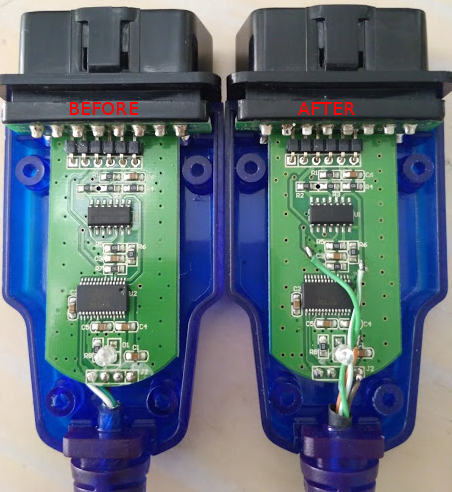

# Bienvenido a FISBlocks!

[[ENG]](./Readme.md)
[ESP]

## Resumen:

El FISBlocks es un dispositivo basado en Arduino que nos permite consultar en tiempo real parámetros mecánicos del vehículo para diagnosticar su estado y predecir averías. Implementa parte del protocolo privado KWP1281 usado en todos los vehículos del grupo VAG (Audi, Seat, Volkswagen...) desde el año 1998 para realizar la diagnosis y obtener la información. Además este dispositivo también implementa parte del protocolo privado 3LB que nos permite controlar el contenido que se muestra por la pantalla secundaria de 2 lineas x 8 dígitos de los cuadros de instrumentos que incorporan tecnología FIS-DIS.

Algunos de los datos interesantes que podemos obtener:
* Litros de combustible
* Temperatura real de refrigerante
* AFR
* Presión de turbo
* IAT
* EGT
* Retrasos/cilindro
* Misfires/cilindro
* MAF
* Voltaje
* Carga del motor
* Valores demandados por la ECU
* ...Y en general, cualquier dato que se pueda obtener a través del Measurement Blocks de la unidad.

.

Este proyecto tiene principalmente 2 objetivos:

* Extraer información de las unidades de mando del vehículo utilizando el protocolo KWP1281 y el Measurement Blocks.

* Implementar protocolo 3LB para mostrar información en el cuadro de instrumentos.

### Actualización 22/12/2017!!!

Si estás interesado en el proyecto y quieres utilizar la versión Premium de FISBlocks se ha desarrollado FISBlocks+ que incorpora entre otros:

* Varios modos de visualización: Pantalla superior (UPPER FIS) o completa (FULL FIS).
* Cambio de parámetros y visualización con la maneta del control crucero.
* Mayor tasa de refresco.
* Mayor cantidad de parámetros por pantalla.
* Mejoras de rendimiento y usabilidad.

#### Haz click en la imagen para ver el video demostrativo:

Haz una donación a la dirección samueliban@gmail.com a través de PayPal indicando tu dirección de correo electrónico para recibir el código completo y contribuye al desarrollo de nuevas funcionalidades.

### Actualización 16/01/2018!!!

Gráficos!

#### Haz click en la imagen para ver el video demostrativo:

Si quieres la versión personalizada de FISBlocks+ que incluye logos al inicio y tener tu propio logo personalizado contribuye al proyecto haciendo una donacion de 25€ a la dirección samueliban@gmail.com a través de PayPal indicando tu dirección de correo electrónico y mándame tu logo en blanco y negro en tamaño 88x64 píxeles, recibirás el código con tu logo personalizado.

## Material necesario para fabricar el FISBlocks:

.

* Arduino UNO o similar (ATmega328)
* USB ODB2 Diagnostic Cable 409.1
* Soldador, estaño cable y nivel de soldadura "Pequeño ninja" :)
* Opcional: Convertidor de 12v a 5v

Estos componentes puedes conseguirlos en muchas sitios en Internet, si tienes problemas para conseguirlos yo te los podría ayudar a conseguirlos, ponte en contacto conmigo a traves de samueliban@gmail.com.

## Preparacion del cable 409.1:

El hack ideado por Andrew consiste en aprovechar el comparador LM que incorpora el cable OBD para utilizarlo con el Arduino mediante SofwareSerial.

Para ello debemos desmontar las carcasas y hacer 3 modificaciones sobre el PCB del cable:

.

* Cortar comunicación con el chip FTDI que va a TX y soldar la nueva linea TX para Arduino.
* Soldar RX para Arduino.
* Soldar linea 5v a 5v Arduino (se utilizará como voltaje de referencia, no para alimentación).

El resultado es este:

.

Una vez realizadas las soldaduras podemos hacer las conexiones con el Arduino.

## Conexiones entre Arduino y los perifiericos:

Lo primero que tenemos que hacer es buscar una fuente de alimentación para el Arduino a 5v. En este caso se ha optado por convertir los 12v que llegan al conector OBD utilizando un transformador de pequeñas dimensiones que cabe dentro del conector OBD, debajo del PCB:

.

Teniendo alimentación para nuestro dispositivo pasamos a realizar las conexiones con el Arduino: para la parte del OBD utilizaremos 2 pines digitales (2-Rx y 3-Tx) y para la comunicación con el cuadro otros 3 pines digitales (4-Enable, 5-Clock, 6-Data).

.

En caso de tener un cuadro de instrumentos FIS-DIS nos faltará hacer la conexción entre el Arduino y el cuadro, para ello debemos localizar las 3 señales del conector que va a la radio (ENA, CLOCK y ENABLE) y conectarlas con los pines del Arduino asignados.
Nota: Haciendo esto se perderá la funcionalidad de mostrar la información de la radio en el cuadro.

Si no se dispone de un cuadro FIS-DIS de manera original o se han instalado a posteriori habría que hacer las conexiones desde el conector verde T32 del cuadro hasta el Arduino.

Ya solo nos queda cargar el programa en el Arduino y conectar el dispositivo en el conector OBD del coche. En este punto debériamos poder conectar con las unidades y empezar a extraer información de ellas, para hacer alguna prueba podemos ver los resultados a traves del monitor serie del IDE del Arduino.

## Contribuir en el proyecto:

Si te ha resultado útil esta información o simplemente te ha parecido interesante puedes contribuir en el proyecto para ayudar en el desarrollo de mejoras o nuevas funcionalidades a través de realizando una donacion económica a traves de PayPal a la cuenta samueliban@gmail.com.

## Futuras mejoras:

* Posibilidad de cambiar los menus utilizando la maneta de control crucero, embrague o freno.
* Mejorar la usabilidad de la pantalla de los cuadros de instrumentos.
* Script para generación de labels espeficicas para cada unidad.
* Movimiento de agujas en el arranque o Needle stagging/sweep a través de KWP1281.
* Creación prototipo PCB encapsulado.

## Agradecimientos & Contacto:

Este proyecto no habría sido posible sin la ayuda de:

* Alexander - http://grauonline.de/wordpress/?p=74
* Tomáš Kováčik - http://kovo-blog.blogspot.com.es/2013/11/audi-fis-3-line-protocol.html
* Nefmoto comunity & the awesome ME7Logger - http://www.nefmoto.com

Puedes ponerte en contacto para cualquier consulta a través del Issue List o mándame un correo a samueliban@gmail.com.
